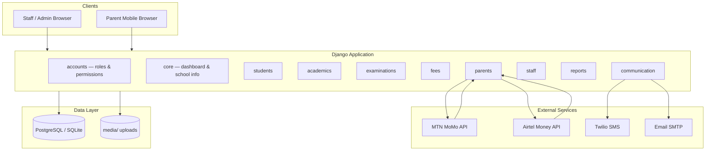

# Architecture

Overview of how Happy Child School is organized and how major features connect.

## High-level diagram



## Django apps

| App | Responsibility |
|-----|----------------|
| `accounts` | Custom `User` model with roles; login; per-user `UserPortalPermission` overrides |
| `core` | Dashboard, school branding, landing images, demo data management command |
| `students` | Student CRUD, enrollment, photos, class placement |
| `teachers` | Teacher profiles linked to `User`, subject/class assignments |
| `academics` | Academic years, classes, subjects, timetables |
| `examinations` | Exam terms, papers, mark entry (subject-scoped for teachers), marks hub |
| `fees` | Fee structures, student fee accounts, payments, mobile money integration |
| `parents` | Parent portal views, child linking, mobile money payment UI and callbacks |
| `staff` | Non-teaching staff, payroll runs and payslips |
| `reports` | Report cards (admin/head teacher), Excel import/export |
| `communication` | Internal messaging, SMS hooks |
| `announcements` | School-wide announcements |
| `logs` | `UserAction` audit trail via middleware |

## Settings layout

```
school/settings/
├── __init__.py      # Loads development or production via DJANGO_ENV
├── base.py          # Shared: apps, middleware, MoMo, email, sessions
├── development.py   # SQLite, DEBUG, ngrok/LAN CSRF middleware
└── production.py    # PostgreSQL, WhiteNoise, HTTPS, logging, validation
```

`manage.py` defaults to `DJANGO_ENV=development`. `wsgi.py` defaults to `production`.

## Authentication and authorization

### Roles

Defined on `accounts.User.role`: `admin`, `headteacher`, `teacher`, `bursar`, `parent`.

### Portal modules

`accounts/portal_modules.py` registers every navigable area (e.g. `fees`, `examinations`, `parent_pay_fees`). Each module lists which roles have default access.

### Per-user overrides

Admins can grant or deny individual modules via `UserPortalPermission`. Resolution order:

1. Explicit override for the user (allow or deny)
2. Role default from `PORTAL_MODULES`

Views use `@portal_module_required('module_code')` and templates use `user.can_access('module_code')` for sidebar visibility.

## Key business flows

### Fee payment (parent)

1. Parent selects child and outstanding balance in `parents` views.
2. `fees/mobile_money.py` initiates MTN or Airtel collection request.
3. Provider sends webhook to `/parents/mobile-money/{provider}/callback/`.
4. `school/security.py` validates callback secret (and optional IP).
5. `fees` records `Payment`, updates student balance.

Simulation mode runs when API keys are empty (development).

### Results access gating

`core/parent_results_access.py` checks whether a parent has outstanding fees. If the school policy blocks unpaid accounts, parents see a message instead of exam results. Admins configure this in fee settings.

### Teacher mark entry

`examinations/teacher_utils.py` restricts teachers to subjects they are assigned. The **My Subjects & Marks** hub lists only relevant class/subject/exam combinations.

### Fee structures

Only admins can create, edit, or delete fee structures. Bursars have read-only access to structures but can record payments.

## Security components

| Component | Location | Purpose |
|-----------|----------|---------|
| `SecurityHeadersMiddleware` | `school/middleware.py` | X-Content-Type-Options, Referrer-Policy, Permissions-Policy |
| `NgrokCsrfOriginMiddleware` | `school/middleware.py` | DEBUG-only: trust ngrok/LAN origins for CSRF |
| `ActivityLogMiddleware` | `school/middleware.py` | Log mutating requests for authenticated users |
| `csrf_failure` | `school/security.py` | Friendly CSRF error page |
| Callback verification | `school/security.py` | Mobile money webhook authentication |
| Production validation | `school/settings/production.py` | Refuse weak secrets, missing hosts, missing callback secret |

## Static and media files

| Environment | Static | Media |
|-------------|--------|-------|
| Development | Django `static/` + `runserver` | Django serves `/media/` when `DEBUG=True` |
| Production | WhiteNoise from `staticfiles/` after `collectstatic` | nginx serves `/media/` from disk |

## Runtime directories (gitignored)

```
runtime/logs/     # Production Django logs
staticfiles/      # Collected static assets
media/            # User uploads (photos, documents)
db.sqlite3        # Development database only
```

## Extension points

- **New portal module:** Add entry to `PORTAL_MODULES`, decorate views, add sidebar link with `can_access`.
- **New payment provider:** Extend `fees/mobile_money.py` and add callback URL in `parents/urls.py`.
- **New report:** Add view in `reports/` with appropriate `@portal_module_required`.